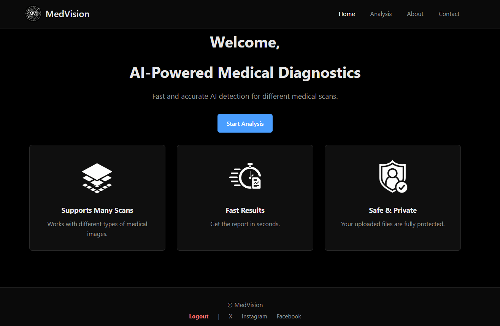
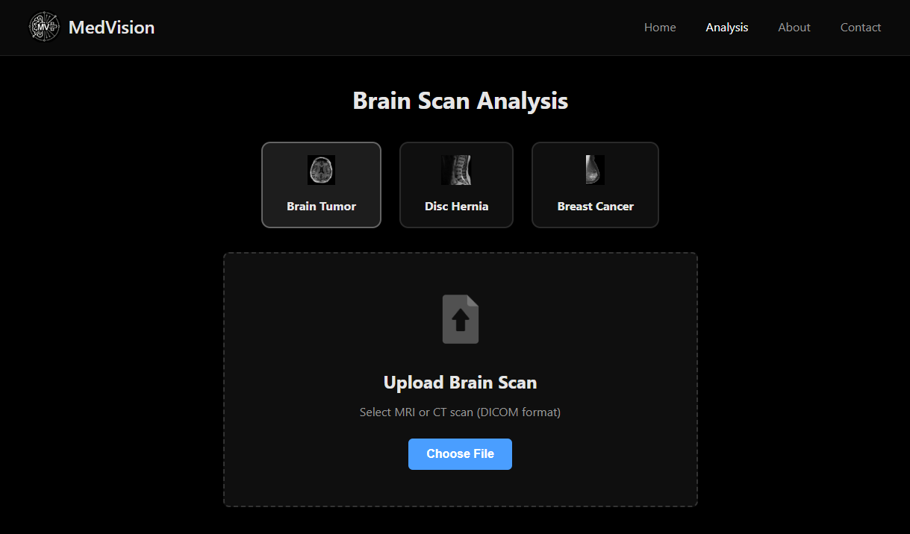

# MedVision — AI-Powered Medical Diagnostics

MedVision is a web-based platform that allows users to upload medical scans and receive AI-powered diagnostic predictions. The system supports three types of medical image analysis in one place, making it faster and easier for healthcare use.

---

## Pages

### Home
The landing page introduces the platform with a brief overview of its features: supports many scan types, delivers fast results, and keeps uploaded files private and secure.



---

### Analysis
Users can select one of three scan types, then upload the corresponding medical image to receive a prediction.

Supported scan types:
- Brain Tumor
- Disc Hernia
- Breast Cancer

Accepted format: MRI or CT scan (DICOM)



---

### About
Describes the mission and vision behind MedVision. The platform combines three AI models into a single interface to support medical image analysis with better accuracy and less time.


---

### Contact
Provides contact information and a message form for users to reach out.

- Email: support@medvision.org
- Phone: +966 11 391 9000
- Address: As-Salam Road, Al Madinah Al Munawwarah


---

## Tech Stack

| Layer     | Technology        |
|-----------|-------------------|
| Frontend  | HTML, CSS, JavaScript |
| Backend   | PHP               |
| Database  | MySQL             |
| Server    | Apache (XAMPP)    |

---

## Project Structure

```
MedVision/
├── images/
├── index.php
├── analysis.php
├── about.php
├── contact.php
├── login.php
├── logout.php
├── script.js
└── style.css
```

---

## Setup (Local)

1. Clone the repository
   ```bash
   git clone https://github.com/Abdulkarim-Mohammed/MedVision.git
   ```

2. Move the project folder to your XAMPP `htdocs` directory

3. Import the database using phpMyAdmin

4. Update the database connection settings in the config file

5. Start Apache and MySQL from XAMPP, then open:
   ```
   http://localhost/MedVision
   ```
